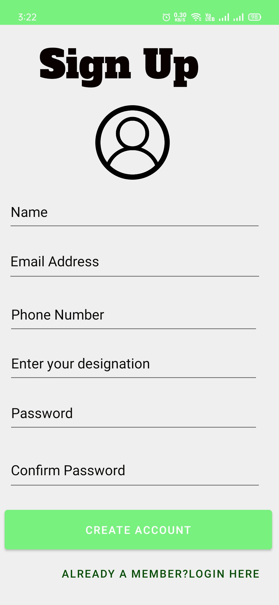

# Krishi-Sadhan
<h1 align="center"> Krishi-Sadhan </h1>

- It is a Cross-Platform Application.
- Helps Farmer to communicate with agriclutural expert as per their need 
   - view complete profile of the expert.
   - can send images of there crops.
   - Call and message directly with the expert.

- Helps farmer to reach expert by siting in their home to get information.

## Featues

- see the cureent location weather 
- can see information about crops
- Realtime Chatting
- Easy to use

## Technologies Used
- Android Studio
    - Java language and XML
    - Frontend + Backend
- Firebase
    - Authentication ------> for authentication of the user
    - Database -----> for storing the data of patient and doctor
    - Storage ------> for profile images
    - Realtime Database -------> for real time Chatting

## Screenshots
## 1. Start Screen

## 1. Sign / Sign Up

## 3. Profile [Patient(left) and Doctor(right)]
- Profile of the expert 

## 4 Chatting
- Farmer and expert can chat directly with each other.

- How chat look alike

##  5 Dashboard

- on left corner we can see there is a drawer base activity

- on clicking on drwawer base this slot will come

- weather activity

## 6 Database
- all data is stored in the database.

---
<h1 align="center"> Thank You </h1>
